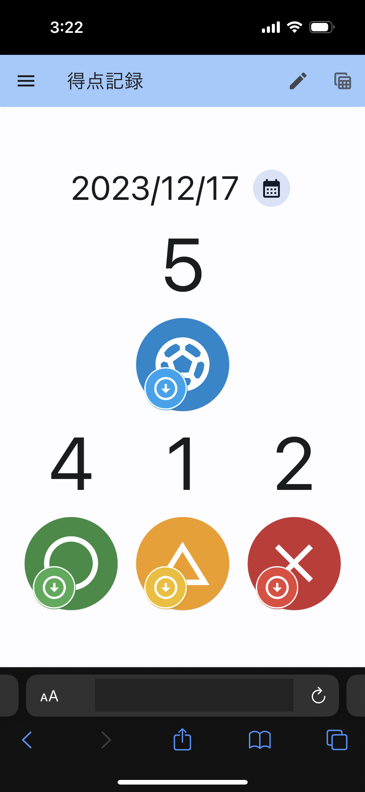
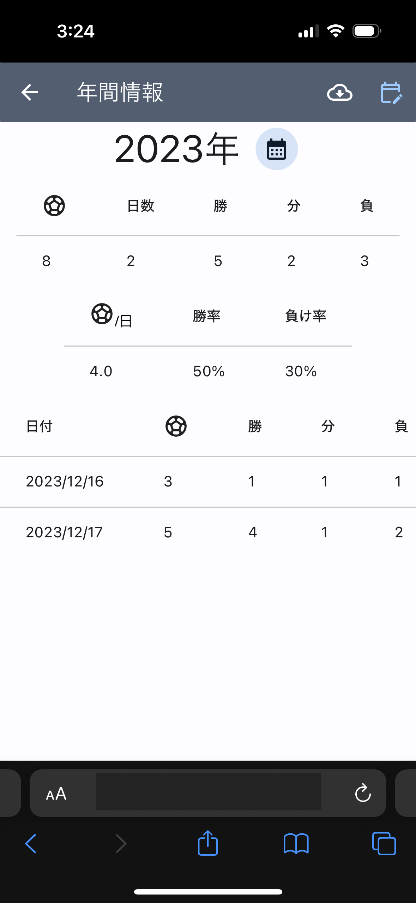
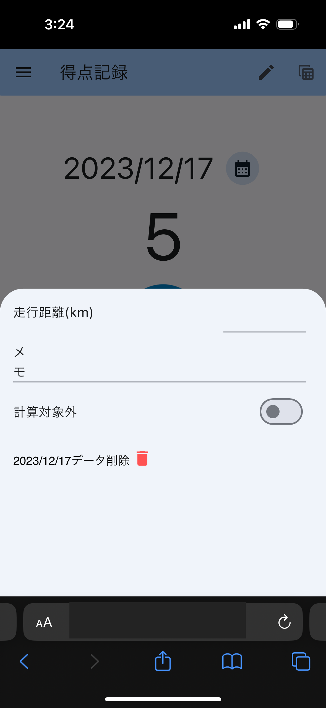

# futsalのゴール数を管理

## what is this?

* futsalのゴールと勝敗を記録するwebアプリ
  * ゴール数の記録
  * 勝敗、引き分けの記録
  * 走行距離、メモの記録
  * 1年の結果表示
  * csvファイルへのダウンロード
  
  
  
* 環境構築に従えば、自分用の環境が出来るはず

## 環境構築

### 開発環境

* flutter: 3.16.3
* node: 20.10.0 (正確な値は .node-version を参照)
* ruby: 3.2.2 (正確な値は .node-version を参照)

### firebase console

* firestoreを有効に
* firebase authを有効に
  * google sign in を有効に → ウエブクライアントID をメモっておく
* `lib/firebase_options.dart` を生成
  * [Flutter アプリに Firebase を追加する](https://firebase.google.com/docs/flutter/setup?hl=ja&platform=web) に従い、 `flutterfire configure` などを実行
* `web/index.html` の 次の `YOUR_GOOGLE_SIGN_IN_OAUTH_CLIENT_ID` を firebase authのgoogle providerの ウエブクライアントIDに書き換え
  ```
  <meta name="google-signin-client_id" content="YOUR_GOOGLE_SIGN_IN_OAUTH_CLIENT_ID.apps.googleusercontent.com">
  ```
  * [参考](https://pub.dev/packages/google_sign_in_web#web-integration)
* firestore のルール設定
  ```
  rules_version = '2';

  service cloud.firestore {
    match /databases/{database}/documents {
      // usersコレクション内のドキュメントに対するルール
      match /users/{userId}/{document=**} {
        // 読み取りと書き込みのアクセスを、認証されたユーザーの自身のドキュメントに限定する
        allow read, write: if request.auth != null && request.auth.uid == userId;
      }
    }
  }
  ```

### 動作確認

```bash
$ flutter run -d chrome
```

### deploy

* [Build and release a web app](https://docs.flutter.dev/deployment/web)を参考に

#### build

```bash
$ flutter build web --release --no-tree-shake-icons
```

#### firebase hosting

```bash
$ firebase init hosting
> Use an existing project
> ... (プロジェクトの選択)
? What do you want to use as your public directory? build/web
? Configure as a single-page app (rewrite all urls to /index.html)? No
? Set up automatic builds and deploys with GitHub? No
✔  Wrote build/web/404.html
? File build/web/index.html already exists. Overwrite? No
i  Skipping write of build/web/index.html

i  Writing configuration info to firebase.json...
i  Writing project information to .firebaserc...

✔  Firebase initialization complete!
$ 
```

#### deploy

```bash
$ firebase deply
```
https://<プロジェクト名>.web.app にデプロイされる


### 「このアプリは Google で確認されていません」「This app isn't verfied」対応

#### 原因

* [OAuth同意画面](https://console.cloud.google.com/apis/credentials/consent)の
> アプリの確認を受けなかった場合はどうなりますか？
> 未確認アプリまたはテストビルドでは、認可リクエストの OAuth スコープに基づいて [未確認アプリの警告](https://support.google.com/cloud/answer/7454865?hl=ja) が表示されます。この警告は、不正なアプリケーションからユーザーとデータを保護するためです。

同じ箇所の「アプリは Google の確認を受ける必要がありますか？」を見ると条件を満たしていないので不要な気もするんだけど...

#### 実施内容

* 新たにドメインを取ってレビューをしてもらった。レビューはアイコンを追加するだけで開始されるので、ドメインが必須かは分からない(ドメイン取った後に気づいた)

* `APIとサービス` → `認証情報` → `ウェブアプリケーションのクライアントID`
  * `承認済みの JavaScript 生成元` に取得したドメインのURLを追加
  * `承認済みのリダイレクトURI` に取得したドメインのURLを追加
* レビューを開始すると、「ドメインの所有権の証明の要件を遵守してください」と出たので
  *　[サイトの所有権を確認する](https://support.google.com/webmasters/answer/9008080?hl=ja) に従って [新しいプロパティを追加](https://support.google.com/webmasters/answer/34592)
  * サブドメインは既にCNAMEを記載していたので大本のドメインのTXTを認証した
* Firebase console → `Authentication` → `Settings` → `Authorized domain` タブに取得したドメインを追加

#### レビューでの指摘事項

* ホームページにプライバシーポリシーのリンクを張ること

#### 参考: 試行錯誤して失敗

最初、下の設定をしたけど、関係なかった
* `APIとサービス` → `認証情報` → `OAuth 2.0 クライアント ID` の `Web client (auto created by Google Service)`
  * `承認済みの JavaScript 生成元` に `https://futsal-goals.web.app` を追加
  * `承認済みのリダイレクト URI` に `https://futsal-goals.web.app/__/auth/handler` を追加
    * [参考](https://pub.dev/packages/google_sign_in_web#web-integration)
* `APIとサービス` → `OAuth同意画面` → `アプリを編集` → `デベロッパーの連絡先情報` にメールアドレスを追加 → 非機密のスコープ で `.../auth/userinfo.email`,  `.../auth/userinfo.profile`, `openid` を選択 (必要ないかも)


## License

MIT
[](https://opensource.org/licenses/MIT)

